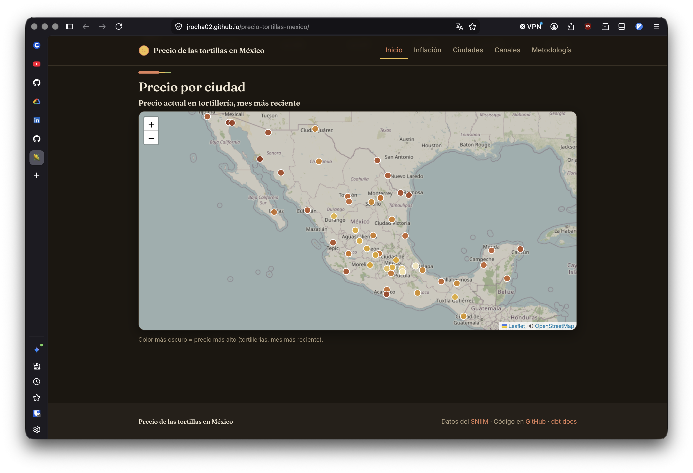

# Precio de las tortillas en México

Tracking the price of tortillas across Mexico, since 2007.

[](#) [](#use-the-data) [](#)

*[Versión en español abajo ↓](#-tortillanomics-es)*

---

## What is this?

A small data project that scrapes daily tortilla prices from [SNIIM](https://www.economia-sniim.gob.mx/TortillaMesPorDia.asp) (the Mexican government's market price tracker), models them with dbt, and publishes clean parquet files that anyone can query.

**~250,000 rows. 56 cities. 19 years of history. Two channels: tortillerías and supermarkets.**

If you want to know how much tortillas cost in Culiacán in March 2014, this repo can tell you in one SQL query.

## Why I built it

Tortillas are the canonical Mexican consumer good. SNIIM has been publishing prices since 2007 in clunky HTML tables but nobody had turned them into something queryable. I wanted to learn dbt properly, and I wanted to build something useful for my country with public data. This is both.

It's also a step toward something bigger — eventually I want to do the same for the rest of the *canasta básica* (eggs, beans, milk, oil) using the same model structure.

## What the data shows

A few things I found interesting while building this:

- **Tortillas are ~3x more expensive than 16 years ago.** Roughly $9/kg in 2010, ~$28/kg in 2026.
- **Supermarkets are ~40–60% cheaper than tortillerías.** Not because they're more efficient; they sell a different product (industrial brands vs fresh made tortillas). The two channels aren't directly comparable.

**Stack:** Python 3.13, `uv`, dbt-duckdb, DuckDB, GitHub Actions, GitHub Pages, SvelteKit (static) + ECharts + Leaflet/OpenStreetMap.

## Project structure
```
precio-tortillas-mexico/
├── ingestion/              # Python scraper (SNIIM HTML → Parquet)
├── data/raw/               # Partitioned Parquet by year / month / channel
├── data/geo/               # Mexican municipio GeoJSON (build-time only, for map centroids)
├── tortillanomics_dbt/     # dbt project
│   ├── models/
│   │   ├── staging/        # Cleaned source data
│   │   └── marts/          # dim_city, fct_tortilla_prices_daily, 3 analytical marts
│   ├── seeds/cities.csv    # Hand-curated city dimension (INEGI codes, region, etc.)
│   └── packages.yml        # dbt_utils, dbt_expectations
├── web/                    # SvelteKit static site (ECharts + Leaflet/OSM)
│   └── scripts/prepare-data.py  # bakes mart Parquet → JSON at build time
└── .github/workflows/      # CI: scrape → build → publish parquet → deploy site
```

## Use the data

You don't need to clone this repo to use the data. Each successful run publishes clean Parquet files to the GitHub releases page. Query them directly with DuckDB:

```python
import duckdb

# Top 10 most expensive cities, latest month
duckdb.sql("""
    SELECT ciudad_canonical, precio_mensual
    FROM 'https://github.com/jrocha02/precio-tortillas-mexico/releases/latest/download/fct_tortilla_prices_daily.parquet'
    WHERE canal = 'tortillerias'
      AND mes = (SELECT max(mes) FROM 'https://...')
    ORDER BY precio_mensual DESC LIMIT 10
""").show()
```

Or in R:
```r
df <- arrow::read_parquet("https://github.com/jrocha02/precio-tortillas-mexico/releases/latest/download/fct_tortilla_prices_daily.parquet")
```

Or in your terminal:
```bash
duckdb -c "SELECT * FROM 'https://github.com/jrocha02/precio-tortillas-mexico/releases/latest/download/fct_tortilla_prices_daily.parquet' WHERE ciudad_canonical = 'Culiacán' LIMIT 10"
```

## Run it locally

```bash
git clone https://github.com/jrocha02/precio-tortillas-mexico
cd precio-tortillas-mexico
uv sync

# Build the dbt models (uses checked-in Parquet, no scraping needed)
cd tortillanomics_dbt
dbt deps --profiles-dir .
dbt build --profiles-dir .

# Optional: re-scrape the latest month
cd ..
uv run python -m ingestion.scrape_sniim --latest
```

The DuckDB file `dev.duckdb` is created on first build; it's gitignored.

### Run the website locally

```bash
# Bake the mart Parquet into JSON (falls back to the public release
# if you haven't run a dbt build / don't have publish/*.parquet locally)
uv run python web/scripts/prepare-data.py

cd web
npm install
npm run dev        # dev server with hot reload
# or a full static build:
BASE_PATH=/precio-tortillas-mexico npm run build   # output in web/build/
```

## Data caveats

A few things worth knowing before quoting numbers from this dataset:

- **Tortillerías channel begins 2010.** SNIIM only published autoservicios before that.
- **Coverage varies year to year.** Autoservicios covers ~50–56 cities; tortillerías covers ~41–43.
- **Channel comparisons aren't apples-to-apples.** Supermarkets sell industrial generic brands; tortillerías sell fresh nixtamal. The price gap reflects product type, not market efficiency.
- **2026 is incomplete.** Year-to-date only.
- **SNIIM occasionally revises past months.** A snapshot model tracks revisions if you care.

## Architecture
```
┌────────────────────┐    ┌────────────────────┐    ┌────────────────────┐
│  SNIIM website     │    │  Python scraper    │    │  Partitioned       │
│  (HTML-as-Excel)   │───▶│  (httpx + pandas)  │───▶│  Parquet files     │
└────────────────────┘    └────────────────────┘    └─────────┬──────────┘
                                                              │
                                                              ▼
┌────────────────────┐    ┌────────────────────┐    ┌────────────────────┐
│  GitHub Pages      │◀───│  dbt docs site     │◀───│  dbt-duckdb        │
│  (auto-deployed)   │    │  (DAG, lineage)    │    │  (star schema)     │
└────────────────────┘    └────────────────────┘    └─────────┬──────────┘
                                                              │
                                          ┌───────────────────┼───────────────────┐
                                          ▼                   ▼                   ▼
                                  ┌──────────────┐   ┌──────────────┐   ┌──────────────┐
                                  │ Inflation    │   │ Dispersion   │   │ Channel gap  │
                                  │ mart         │   │ mart         │   │ mart         │
                                  └──────────────┘   └──────────────┘   └──────────────┘
```

## Roadmap

- [ ] Fill `population_2020` in the cities seed (INEGI 2020 census)
- [ ] Surface `mart_price_dispersion` on the site (built & published but not yet charted)
- [ ] Expand to canasta básica (huevo, frijol, leche, aceite) — same model structure, new sources
- [ ] News geocoding layer that pairs price changes with news mentions

**🔗 [Live dashboard](https://jrocha02.github.io/precio-tortillas-mexico/)** · **📚 [dbt docs](https://jrocha02.github.io/precio-tortillas-mexico/dbt-docs/)** · **📦 [Download data](https://github.com/jrocha02/precio-tortillas-mexico/releases/latest)**

[](https://jrocha02.github.io/precio-tortillas-mexico/)


## License

[MIT](LICENSE). Data sourced from SNIIM (public domain) — please attribute when using.

---

<a id="-tortillanomics-es"></a>
# Precio de las tortillas en México (ES)

Rastreando el precio de la tortilla en México, desde 2007.

## ¿Qué es esto?

Un proyecto que extrae los precios diarios de la tortilla desde [SNIIM](https://www.economia-sniim.gob.mx/TortillaMesPorDia.asp), los modela con dbt, y publica archivos Parquet limpios para que cualquiera pueda hacer consultas.

**~250,000 filas. 56 ciudades. 19 años de historia. Dos canales: tortillerías y autoservicios.**

## ¿Por qué lo construí?

La tortilla es el bien de consumo mexicano por excelencia. SNIIM publica precios desde 2007 en tablas HTML, pero nadie las había convertido en algo realmente consultable. Quería aprender dbt en serio y construir algo útil para mi país usando datos públicos. Esto es ambas cosas.

A largo plazo quiero hacer lo mismo con el resto de la canasta básica (huevo, frijol, leche, aceite) usando la misma estructura de modelos.

## Qué muestran los datos

- **La tortilla cuesta ~3x más que hace 16 años.** ~$9/kg en 2010, ~$28/kg en 2026.
- **Los autoservicios son ~40–60% más baratos que las tortillerías.** No por eficiencia: venden un producto distinto (Super vs. Tortillerias).
- **Las ciudades más caras tienden a estar en la frontera norte** (Cd. Juárez, Tijuana, Hermosillo); las más baratas en el sur (Tampico, Xalapa, Puebla).

## Cómo usar los datos

Mismos enlaces y ejemplos que arriba — los archivos Parquet en GitHub Releases funcionan directamente desde DuckDB, Python, R o el navegador.

## Cómo ejecutarlo localmente

```bash
git clone https://github.com/jrocha02/precio-tortillas-mexico
cd precio-tortillas-mexico
uv sync
cd tortillanomics_dbt
dbt deps --profiles-dir .
dbt build --profiles-dir .
```

## Licencia

[MIT](LICENSE). Datos de SNIIM (dominio público) — favor de citar la fuente.
